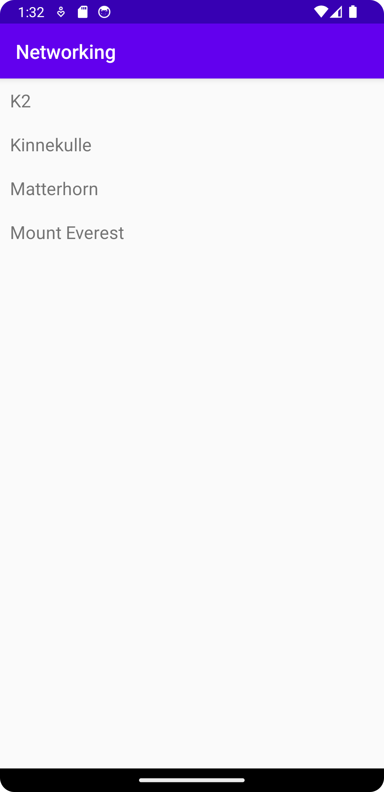

# Rapport
Projektet börjades med att skapa en mountain-klass med namn, location och height.En recycler view lades till i activity_main.
Recycler Viewen fylldes på med en lista av direkt skapade mountains likt tidigare projekt.  
Sedan lades en recycler view adapter till som bindes till recycler viewn i MainActivity.java onCreate. Detta är en färdig kod-fil från kursen som gör att recycler view:en kan ändras med ny data.  
Eftersom MainActivity.java implementade JsonTask så kunde en onPostExecute-metod skapas och ändras för att hämta hem JSON-data från ett api som gavs ut för uppgiften.  
I metoden onPostExecute tar den den hämtade JSON-stringen och hanterar den genom att plocka ut värden och object och skapa mountain-object i appen. I en senare lösning ändrades denna hantering till att göra om den till GSON istället och "unmarshalla" JSON:ets objekt till rena mountains. Den lösningen krävde mycket mindre kod.  
De hanterade nya mountain-objekten lades sedan till i recycler viewens lista med mountains, och recycler view adapter updaterades för att göra så att det återspeglas i appen när den körs.
# Kod
```
@Override
    public void onPostExecute(String json) {
        Gson gson = new Gson();
        Type type = new TypeToken<ArrayList<Mountain>>() {}.getType();
        ArrayList<Mountain> listOfMountains = gson.fromJson(json, type);
        items.addAll(listOfMountains);
        adapter.notifyDataSetChanged();


    }
```
Kod som beskriver hur den hämtade JSON-datan hanteras genom GSON där den hämtar alla objekt och gör om dem direkt till mountain-objekt. Objekten läggs sedan till i listOfMountains och en adapter uppdateras så att recycler viewen i appen visar objekten.

# Bild

Bild på listan av de hämtade JSON-objekten i en recycler-view.
